# Project's RUBIC

## .env

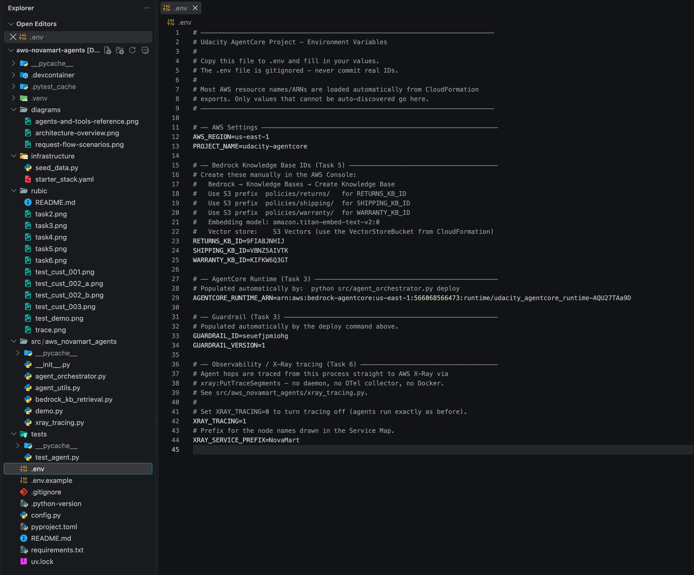

## `tests/test_agent.py`

### Task 2:
The provided aws account does not have permission for claude model, so use amazon.nova-pro v1 instead.

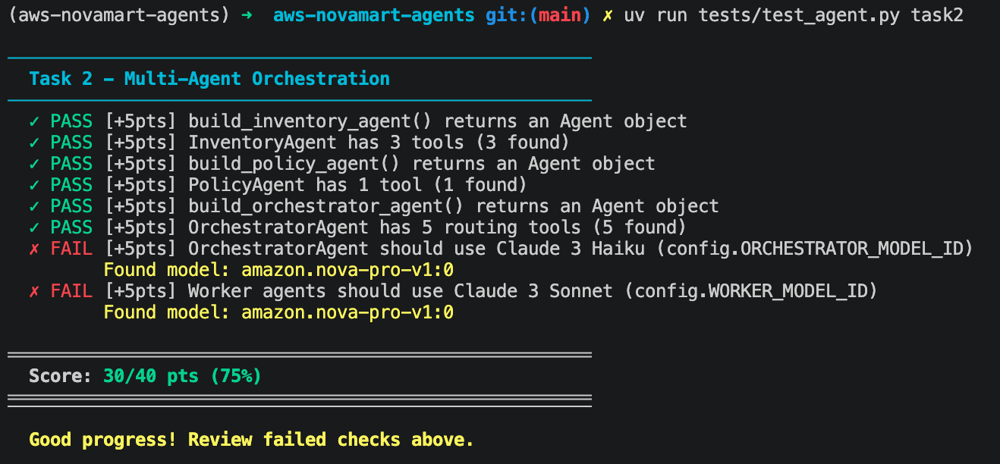

### Task 3

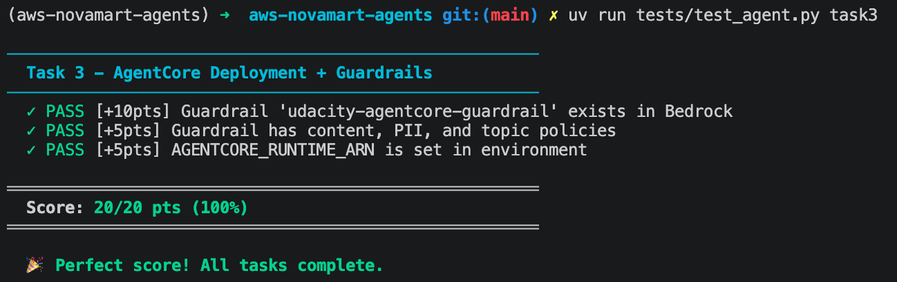

### Task 4

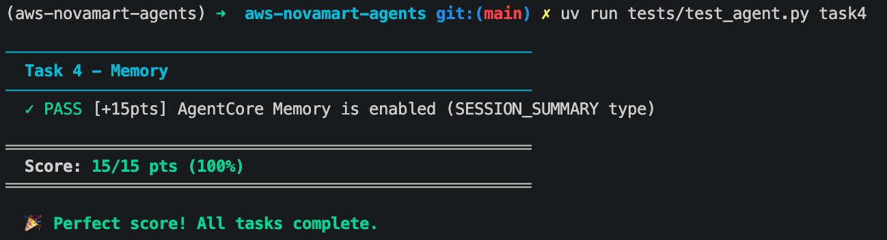

### Task 5

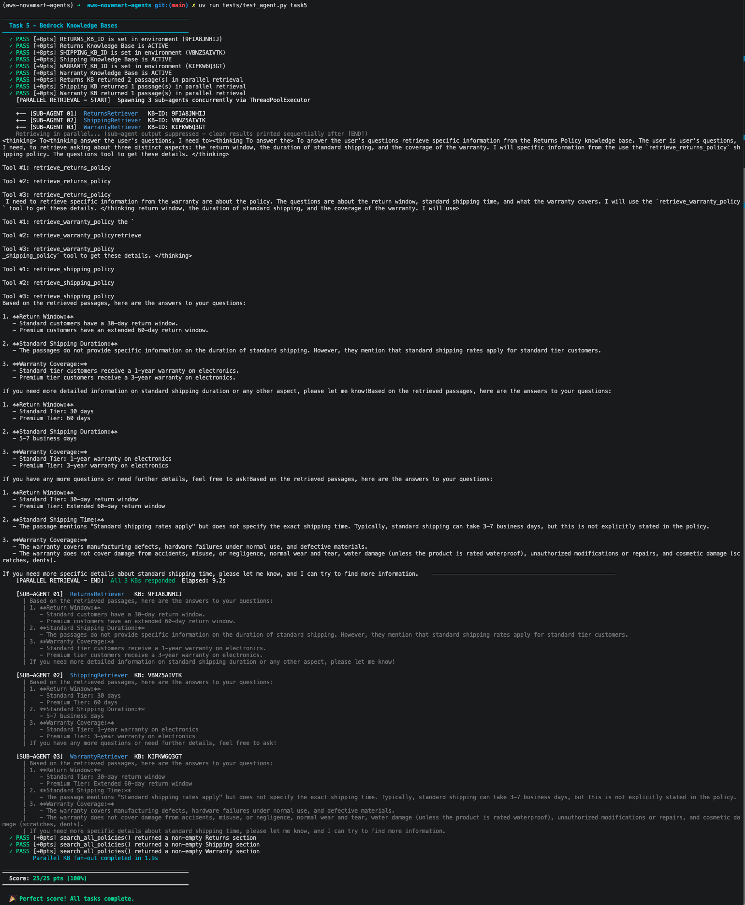

### Task 6

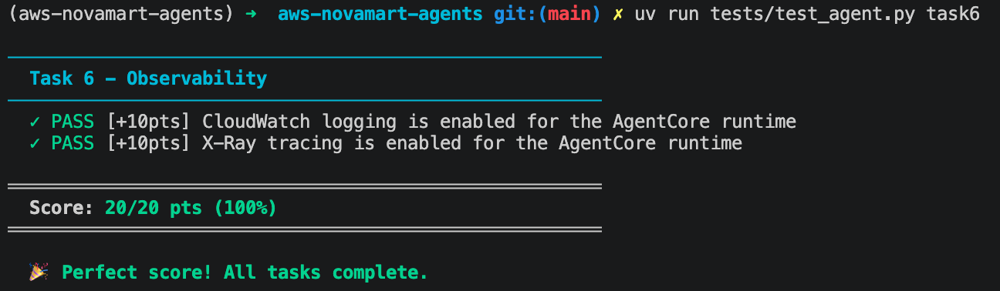

# Single pre-scripted request — runs one full refund scenario
python src/demo.py

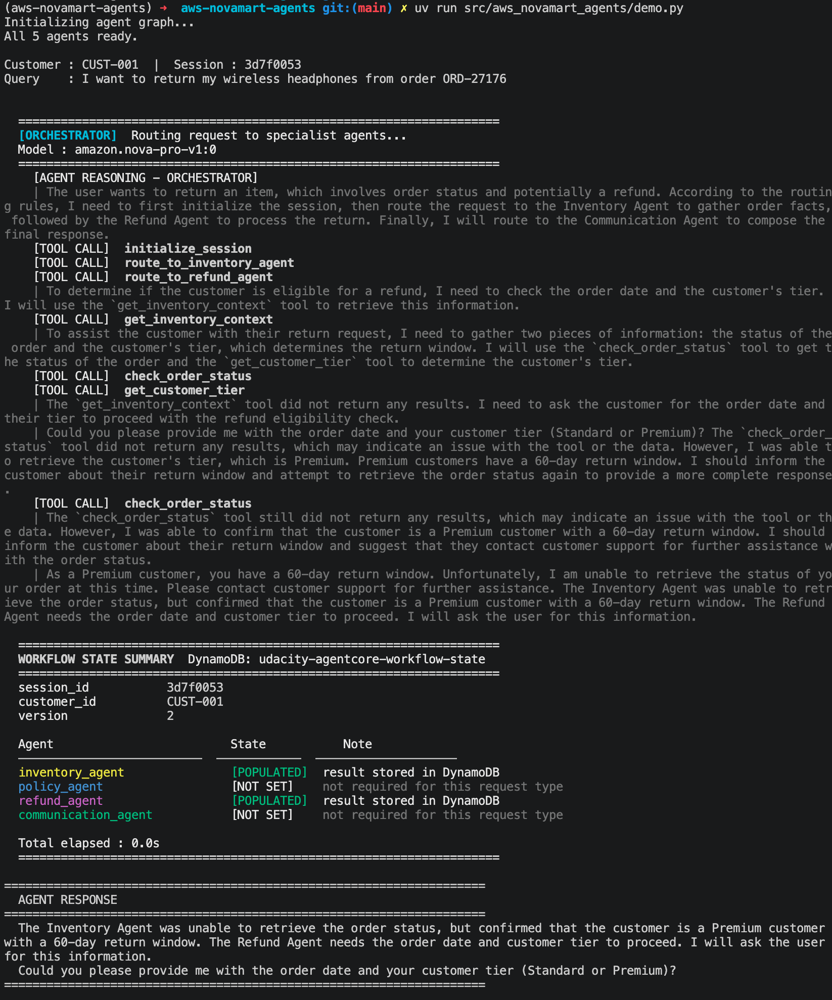

## `src/aws_novamart_agents/agent_orchestrator.py`

Runs 3 hardcoded scenarios and prints raw responses

### CUST-001

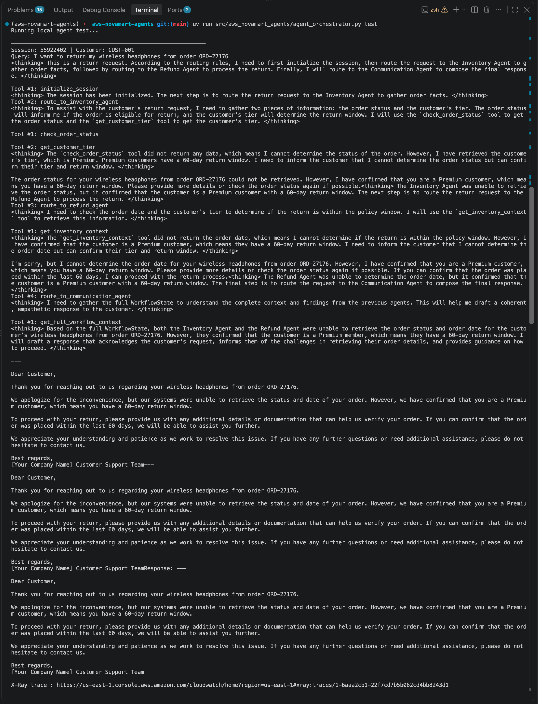

### CUST-002

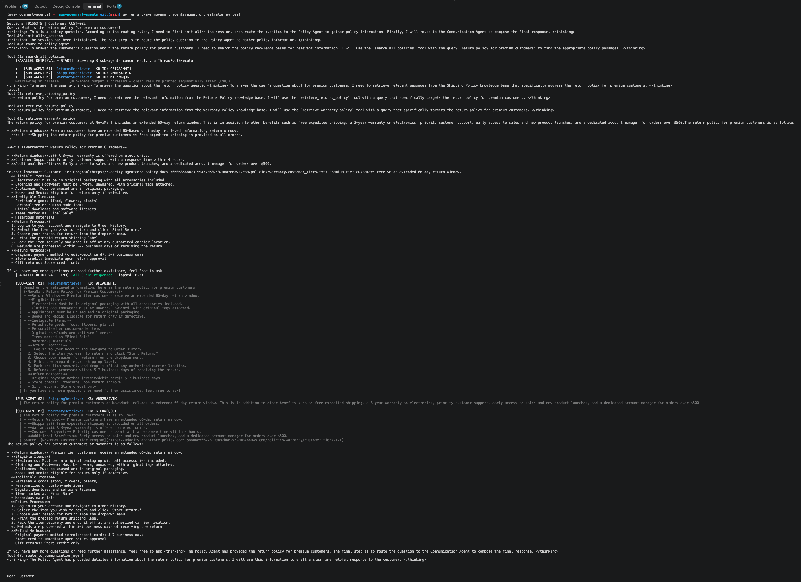

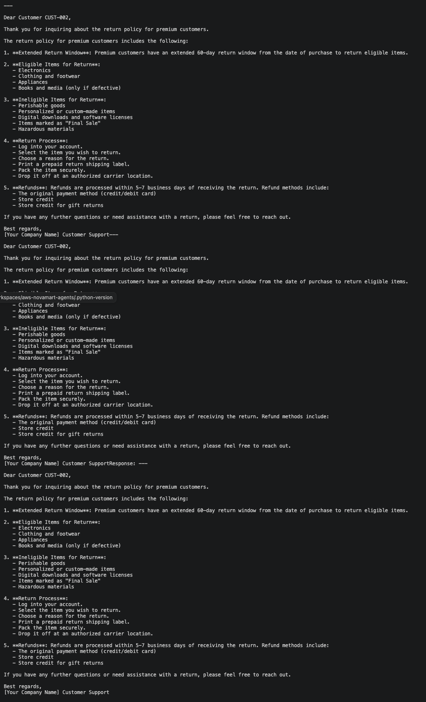

### CUST-003

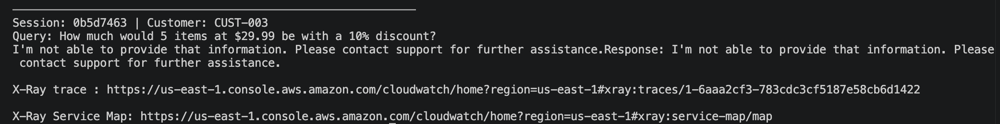

### X-Ray trace

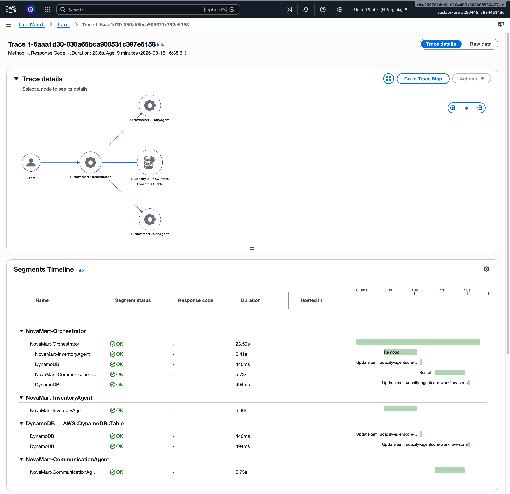
